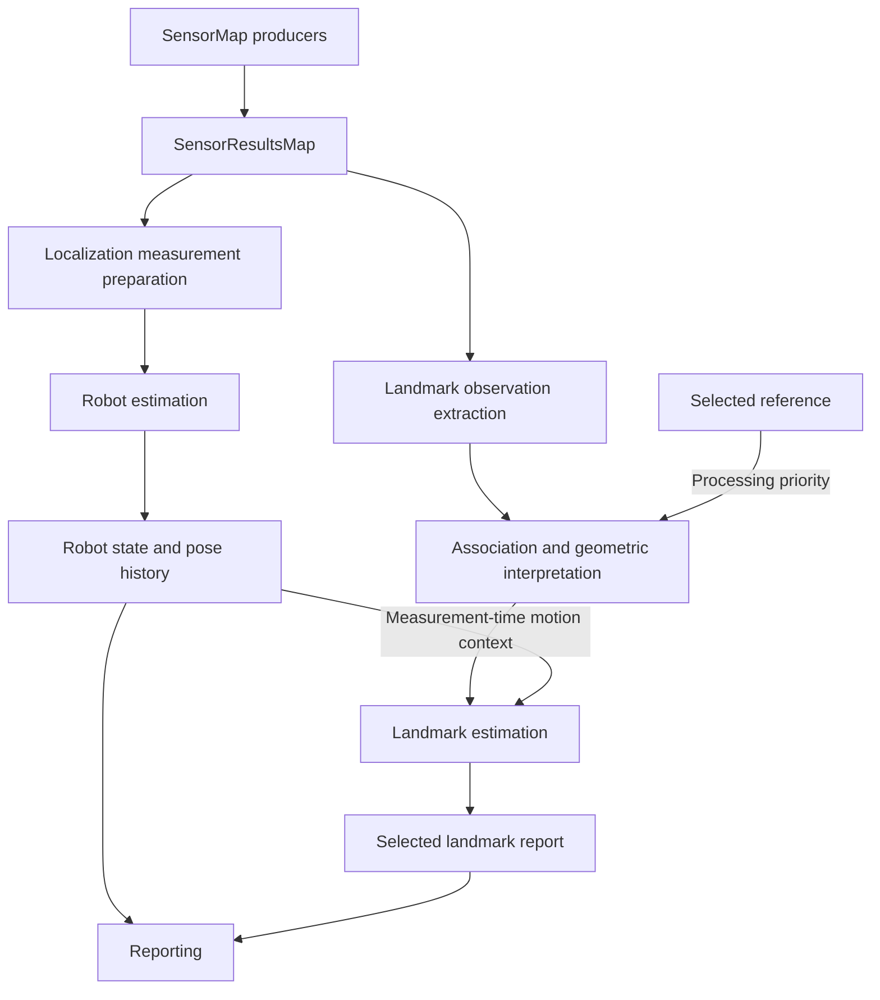

# Runtime architecture

Navigatr provides robot localization and information about a requested physical
reference through one Brain connection. The framework defines data boundaries,
ownership, and scheduling. Configured implementations define the sensors and
estimation algorithms behind those boundaries. These are design requirements;
see [implementation coverage](../README.md#implementation-coverage) for executable
support.

## Components and ownership

| Component | Owns | Publishes or provides |
|---|---|---|
| Resources | Shared devices, decoders, immutable geometry and calibration. | Explicitly bound device and configuration interfaces. |
| SensorMap | Configured measurement producers indexed by opaque sensor ID. | Publications with declared payload types. |
| SensorResultsMap | The standardized read view of sensor records. | Health, latest sample, measurement and receipt times, source sequence. |
| Localization pipeline | Robot estimation state and recent motion history. | Complete state snapshots and timestamped pose lookup. |
| Landmark-estimation pipeline | Accepted evidence and a cache of measured object estimates. | Selected landmark geometry and observation provenance. |
| Command handling | Initial pose, selection, request generation, stream controls. | Consistent command snapshots. |
| Reporting | Consumer representation and transport. | Robot state, at most one requested landmark, timing, and availability. |

The Brain owns desired robot poses, standoff, mechanism offsets, front/rear
approach, control, and completion. The landmark estimate describes physical
geometry; it does not embed those behavior decisions.

## Pipelines and standard I/O



Arrows represent data dependencies. There is no global requirement to complete
every box once before another pipeline can advance. Association may also consult
motion history or static geometry when its implementation needs those priors.

| Pipeline | Standard input | Standard output |
|---|---|---|
| Localization | Declared measurements, initialization/reset commands, prior estimator state. | Robot pose, effective time, reference identity, validity, and recent pose history. |
| Landmark estimation | Declared measurements, selection, static reference geometry, available motion history, prior landmark state. | Identified landmark geometry, measurement provenance, effective time, and last accepted observation time. |
| Reporting | Published estimates plus relevant health and command state. | Defined Brain report; no estimator mutation. |

Each stage has a declared input/output contract. An implementation may be one
algorithm or a composite containing a private sequence. A composite publishes
only its declared outputs. Failed work cannot publish a partially updated
estimate.

Inside a pipeline, a typed batch can pass through filtering, annotation,
association, and estimation. Each boundary defines the fields available to the
next stage. Observations retain source identity and measurement time as metadata
is added. Persistent estimator state has one owner and is not an unrestricted
mutable packet passed through unrelated stages.

Consumers bind to source IDs and payload contracts during startup. For example,
a localization implementation can consume body-motion increments without knowing
which encoders produced them. Another may consume pose observations. Landmark
observations may originate from cameras, range sensors, or other suitable
measurements. Neither outer interface requires AprilTags, wheels, or a particular
number of sensors. A payload must express what was measured: an image region
alone cannot promise a full metric pose.

## Scheduling and handoff

Use one executable with independently scheduled localization and landmark workers.
Stages inside a worker run in their declared order. Resource acquisition and
transport may have their own workers or asynchronous callbacks as needed.
Execution frequency and resource budgets belong to configured implementations;
the framework does not assume localization is faster than landmark estimation.

Localization computes its next state privately and publishes a complete snapshot.
A landmark operation reads a consistent published state or history snapshot when
needed. A short mutex-protected handoff or an appropriate atomic snapshot
publication can implement this. Do not hold shared locks during detection,
estimation, blocking device reads, or output writes.

Sensor collection obtains available publications. Waiting for one physical sensor
must not block unrelated producers. Shared links have one acquisition/decoder
owner that distributes their channels. Consumers must not independently drain
the same device. Expensive preparation belongs to its consuming pipeline, or to
an independently scheduled shared producer if several consumers need its output.

The result map is a read interface, not sufficient storage for every possible
measurement stream. Queue or accumulate measurements according to their meaning.
Replacing pending camera frames with newer ones can bound latency; dropping
intervening motion increments or angular-rate samples can lose motion. Each
consumer tracks consumed source sequences. Reading a retained sample again does
not produce another measurement.

Sensor health, new publication, and measurement freshness are separate. A healthy
sensor between samples retains its latest record. A fault does not rewrite its
measurement timestamp. Reporting and transport must also have bounded work so
their backpressure cannot stop estimation.

## Pose history

Keep the latest robot state and a time-ordered ring buffer of recent poses. Five
seconds is the initial retention target; configure the window and maximum lookup
gap from measured sensor latency and acceptable error. At 50 pose publications
per second, five seconds contains about 250 samples. A faster producer needs
more capacity to retain the same duration.

Each entry identifies the host-clock effective time, odometry epoch, and pose of
the fixed robot origin in smooth odometry coordinates. Entries are logically
sorted by time even when the ring wraps physically. Binary-search that logical
order for bracketing samples. Search is O(log N); no benchmark is implied.

For measurement time `t` between samples `t0` and `t1`, use:

```text
f = (t - t0) / (t1 - t0)
x(t) = x0 + f * (x1 - x0)
y(t) = y0 + f * (y1 - y0)
yaw(t) = wrap(yaw0 + f * wrap(yaw1 - yaw0))
```

This is a short-interval interpolation model. Gate the bracketing interval and
motion conditions so unresolved motion between samples does not become a claim
of precision. Exact timestamp matches use the recorded pose. Reject measurements
older than retained history or across invalid gaps/epochs. A measurement newer
than available history can wait in a bounded pending queue for a bracket; expiry
is explicit. Do not silently clamp unsupported times to the nearest pose.

Append later timestamps and define replacement for a revised estimate at the same
timestamp. Do not append out-of-order entries. A discontinuous odometry reset
starts a new epoch. Lookups must see a consistent ring layout and anchor revision
while the writer appends or retires entries. A reader copies the required samples
or retains an immutable history snapshot before releasing the handoff lock.

## Time, identity, and lifecycle

A measurement timestamp describes when sensing happened. Receipt, processing
completion, and report transmission are separate times. Camera metadata must
define the exposure-time convention; timebase conversion must place camera and
motion samples on a common monotonic clock. Source restarts cannot silently reuse
an earlier sequence/time identity.

Late observations use the robot pose at measurement time, then the transforms in
[Coordinates](coordinates.md#measurement-time-transforms). Processing delay does
not change the observation time. Pose history corrects temporal registration;
it does not remove measurement error, subsequent odometry drift, or unseen
landmark motion.

Selection has an identity and a generation. Reporting reads the current request
and the matching cache entry; clearing or changing that request immediately changes
what may be reported. Independently validated late evidence can update the cache
under its object identity and ordering policy, but cannot reactivate an old request
or overwrite the selected result with another object's data. Selection-specific
work must also validate its generation before committing selection-specific state.
Field-definition identity, field-anchor revision, and odometry epoch accompany
state so incompatible coordinates cannot be combined.

Reporting reads consistent snapshots. If robot and landmark estimates have
different effective times, preserve that timing or reconcile them at a supported
time. A common packet timestamp cannot conceal the difference. A stationary
landmark may be carried to report time under an explicit stationarity assumption;
its last accepted observation time still remains unchanged.

## Behavioral verification

Verify that delaying either estimator does not stall the other's publications;
that motion contributions survive batching; and that a sensor stall does not
block unrelated acquisition. Exercise ring wrap, angular wrap, history expiry,
unsupported gaps, source restarts, selection changes during processing, and
coordinate resets. Verify handoffs never expose mixed state and that an
observation is consumed at most once by a given estimator.

Measure capture-to-result age, estimator publication intervals, dropped work,
and physical alignment error independently. Processing rate and successful host
tests do not establish measurement accuracy.
