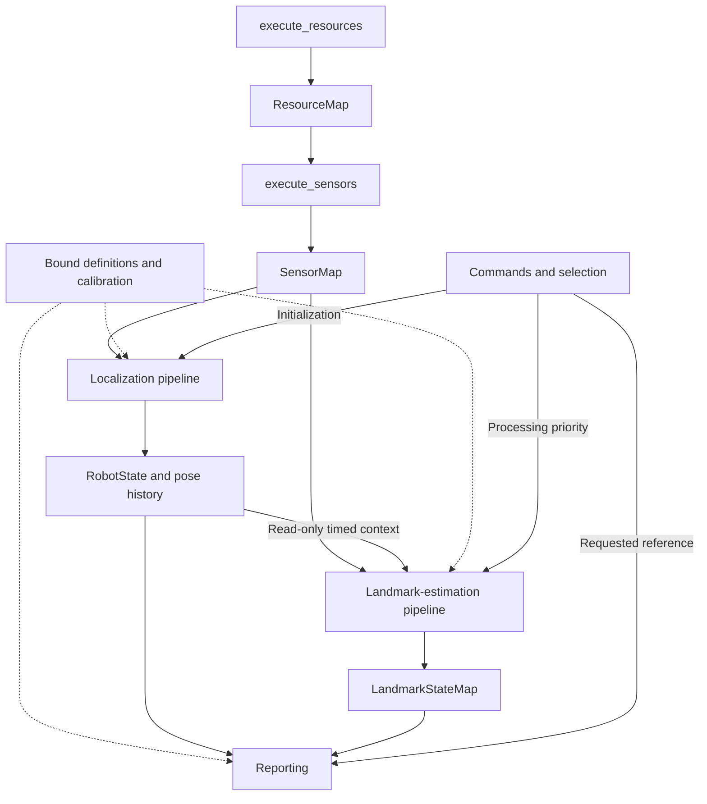

# Runtime architecture

Navigatr provides robot localization and information about a requested physical
reference through one Brain connection. The framework defines data boundaries,
ownership, and scheduling. Configured implementations define the sensors and
estimation algorithms behind those boundaries. These are design requirements;
see [implementation coverage](../README.md#implementation-coverage) for what the
executable supports today. Where a section below has an "Implemented form"
note, that note names the concrete code.

## Components and ownership

| Component | Owns | Publishes or provides |
|---|---|---|
| FunctionRegistry | Registered construction functions, separated by factory signature and implementation name. | Factories selected by XML type. |
| ResourceFunctions | Private collection of configured resource executables captured by execute_resources. | Child records assembled into ResourceMap by the aggregate executor. |
| ResourceMap | A read-only snapshot of resource execution results indexed by resource ID. | Named outputs with typed payloads, health, timing, and source identity. |
| SensorFunctions | Private collection of configured preprocessing executables captured by execute_sensors. | Child records assembled into SensorMap by the aggregate executor. |
| SensorMap | A read-only snapshot of sensor execution results indexed by sensor ID. | Declared measurement payloads, health, timing, and provenance. |
| Localization pipeline | Robot estimation state and recent motion history. | Complete state snapshots and timestamped pose lookup. |
| Landmark-estimation pipeline | Accepted evidence and a cache of measured object estimates. | An immutable LandmarkStateMap snapshot with geometry and observation provenance. |
| Command handling | Initial pose, selection, request generation, stream controls. | Consistent command snapshots. |
| Reporting | Consumer representation and transport. | Robot state, at most one requested landmark, timing, and availability. |

The Brain owns desired robot poses, standoff, mechanism offsets, front/rear
approach, control, and completion. The landmark estimate describes physical
geometry; it does not embed those behavior decisions.

## Construction and resource binding

The executable selects its main XML file from `--config_file` or its compiled
default path. Framework sections can be inline or use `file="..."` references;
the loader expands them recursively before any factory runs. Each relative
reference uses its containing XML file as the base. See
[configuration](configuration.md) for the run commands, default selection, and
supported include boundaries.

Factories initialize and capture state once. Each category builder returns one
bound aggregate executor. That executor owns iteration over its private child
functions and returns the category's output map.

```text
ResourceXml + FunctionRegistry
  -> make_resources
  -> execute_resources, capturing ResourceFunctions

SensorXml + FunctionRegistry + declared resource-output contracts
  -> make_sensors
  -> execute_sensors, capturing SensorFunctions

Declared sensor outputs + estimator configuration
  -> construct localization and other consumers
  -> validate complete bindings
  -> start independently scheduled work
```

make_resources is the category-level builder: it visits Resource declarations,
uses each type to find the registered factory, and stores each constructed
executable under its configured ID. Several declarations can use the same type.
The selected factory interprets the remainder of its XML subtree, initializes
what it needs, and returns a callable with that state captured.
The category builder captures the complete collection in execute_resources and
exposes the aggregate's declared outputs alongside its callable.

make_sensors follows the same pattern. A sensor factory parses its specific
input roles, validates the selected resource outputs and their expected payload
contracts, and captures those bindings and its preprocessing state. Startup
validation uses declared output contracts; it does not require a device to have
already produced a sample.
The category builder returns execute_sensors with that collection captured. The
top-level coordinator calls the aggregate; it does not iterate individual sensors.

Shared connections and device handles live in initialized state with explicit
ownership. A builder may resolve shared dependencies before constructing their
consumers. Missing references, duplicate IDs, dependency cycles, and incompatible
contracts fail before execution. ResourceMap carries execution results; it does
not own the devices or factory functions.

Static field definitions, geometry, and calibration can be initialized and bound
directly to their consumers. They do not require repeated acquisition or sensor
wrappers. Transport ownership similarly belongs to the initialized components
that use it. Shutdown joins workers before releasing their captured dependencies;
a shared component is reset once and its new sequence/time epoch is propagated.

### Registry, factories, and captured execution

Each category has an implementation folder and an explicit registration entry
point. Registration makes a type available; XML selects configured instances.

```text
register_resources(registry): resource type -> resource factory
register_sensors(registry):  sensor type   -> sensor factory

make_resource(ResourceXml, initialization_context):
    state = initialize_from(ResourceXml, initialization_context)
    return context => execute_resource(state, context)

make_sensor(SensorXml, declared_resource_outputs):
    bindings, state = initialize_from(SensorXml, declared_resource_outputs)
    return (resource_map, context) =>
        execute_sensor(state, bindings, resource_map, context)
```

These are conceptual signatures. Each executable also declares its outputs and
any lifecycle operations. A resource's device handles and parsed configuration
are captured; they are not passed or reconstructed on every invocation.

ExecutionContext can supply the current monotonic time and an invocation identity,
plus configured diagnostics or a work deadline where needed. Implementations that
need no runtime context can ignore it. The execution clock is not automatically
the measurement timestamp, and an invocation ID does not synchronize independent
workers.

A sensor receives the complete read-only ResourceMap snapshot. Its configured
bindings tell it which entries to read. For example, an IMU implementation expects
an IMU input with a particular payload contract; its XML chooses the resource ID
and output ID supplying that input. It does not need a generic expression language
to discover arbitrary fields or infer their physical meaning.

### Resource and sensor result contracts

ResourceMap and SensorMap are the standard outer data contracts. Payloads are
typed implementation contracts carried inside standard record envelopes.

```text
ResourceMap:
    resource ID -> ResourceRecord

ResourceRecord:
    resource status
    outputs: output ID -> MeasurementRecord

MeasurementRecord:
    output status
    optional latest sample:
        typed payload
        measurement time or time interval
        receipt time
        source sequence and epoch
        required frame/provenance metadata

SensorMap:
    sensor ID -> MeasurementRecord
```

Every resource record uses the named-output collection, including a resource with
only one output. Thus the consumer uses the same addressing convention for a
standalone source and a source carrying several measurements. The payload can
itself be a scalar, structured sample, frame handle, or a supported batch; the
envelope does not force it into an arbitrary dictionary.

```text
ResourceMap["pico"].outputs:
    "encoder_a" -> encoder-count record
    "encoder_b" -> encoder-count record
    "imu"       -> IMU record

ResourceMap["standalone_imu"].outputs:
    "imu"       -> IMU record
```

These output names are illustrative configuration IDs. A resource implementation
knows how to obtain its native channels and can expose configured names for the
outputs it supports. A consumer's binding includes resource ID and output ID;
an output name need only be unique within its resource. Resource-level status
and individual output status remain distinct when only some channels are present
or usable.

SensorMap uses configured sensor IDs for processed results. Executable collections
are called ResourceFunctions and SensorFunctions, leaving the map names for data.

### Sensor measurements and downstream interpretation

Sensors perform measurement preprocessing. Their work can range from selecting
an already usable source output to decoding, calibration, bias estimation, and
integration. Each implementation retains the previous readings and calibration
state its operation requires.

```text
ResourceMap["pico"].outputs["encoder_a"]
  -> configured tracking-wheel sensor
  -> SensorMap["left_wheel"]

ResourceMap["pico"].outputs["imu"]
  -> configured IMU sensor
  -> SensorMap["robot_imu"]
```

An IMU implementation may publish bias-corrected angular rate, an integrated angle,
or a timed angular increment. Its output contract identifies which quantity it
provides, its frame and time support, and the corrections already applied.
Consumers must not correct or integrate the same contribution twice. Integration
preserves intervening samples or an appropriate accumulator and handles source
discontinuities. An integrated relative angle is not an absolute field heading.

A forwarding sensor is valid when its selected input already satisfies its output
contract. Downstream observation construction applies the declared robot models
to those measurements, and state estimation updates the robot pose. A camera
sensor can still publish an image rather than a metric pose.

A dedicated resource declaration for each physical sensor is not required. One
resource can acquire several channels, as in the Pico example. Resource
acquisition owns the shared read/decode operation; sensor functions process its
published outputs without independently draining the same stream. Private
preprocessing state belongs to each sensor executable.
For an A/B encoder, edge counting belongs in the hardware-facing driver/acquisition
implementation; the current Pi telemetry path receives counts, not individual
A/B transitions.

## Pipelines and standard I/O

The logical execution sequence uses one call per stage:

```text
execute_resources -> ResourceMap
  -> execute_sensors -> SensorMap
  -> execute_localization -> RobotState + pose history
```

At the top level, construction and execution remain short:

```text
execute_resources = make_resources(resource_xml, initialization_context)
execute_sensors = make_sensors(sensor_xml, initialization_context)
execute_localization = make_localization(localization_xml, initialization_context)

# One logical update; the configured scheduler invokes these stages.
resource_map = execute_resources(context)
sensor_map = execute_sensors(resource_map, context)
localization_output = execute_localization(sensor_map, context)
```

Iteration and map assembly belong inside the returned aggregate executors:

```text
make_resources(xml, initialization_context):
    resource_functions = build_resource_functions(xml, initialization_context)

    execute_resources(context):
        resource_map = {}
        for resource_id, execute_resource in resource_functions:
            resource_map[resource_id] = execute_resource(context)
        return resource_map

    return execute_resources

make_sensors(xml, initialization_context):
    sensor_functions = build_sensor_functions(xml, initialization_context)

    execute_sensors(resource_map, context):
        sensor_map = {}
        for sensor_id, execute_sensor in sensor_functions:
            sensor_map[sensor_id] = execute_sensor(resource_map, context)
        return sensor_map

    return execute_sensors
```

These are conceptual signatures; output declarations and lifecycle operations
remain part of the executable contract. Runtime context may be supplied through
a bound provider where appropriate. Stage-to-stage data dependencies stay explicit.
Child selection, ordering, and record assembly are private to the stage. The same
rule applies recursively when a child is itself a composite.

An output record includes retained sample state and current health. A poll with no
new measurement preserves the prior sample's timestamp and sequence; no result is
silently turned into a zero or counted as fresh evidence. Maps can be constructed
as snapshots using shared immutable records and frame handles.

The loops describe logical composition, not a global requirement to finish every
resource before any sensor or estimator may advance. Slow or blocking acquisition
runs independently and publishes complete records. Consumers take coherent
read-only map views containing available outputs; they need not wait for all
sources to update together. Within a configured composite, children run in their
declared order. The [scheduling contract](#scheduling-and-handoff) defines buffering,
handoff, and bounded work.



Solid arrows describe publications or readable runtime context; dashed arrows
describe retained configuration bindings. There is no shared mutable work item
travelling through both estimation workers.

| Pipeline | Standard input | Standard output |
|---|---|---|
| Resources | ExecutionContext; captured initialized state and configuration. | ResourceMap of named source-output records. |
| Sensors | Read-only ResourceMap and ExecutionContext; captured bindings and preprocessing state. | SensorMap of processed measurement records. |
| Localization | Relevant SensorMap records/batches, initialization/reset requests, prior estimator state. | RobotState snapshot and associated pose history. |
| Landmark estimation | Relevant SensorMap records/batches, selection priority, available robot history, prior LandmarkStateMap; bound field/calibration. | LandmarkStateMap snapshot containing measured estimates and provenance. |
| Reporting | Published RobotState and LandmarkStateMap snapshots, current selection and health; bound reference definitions. | Robot report plus at most one requested landmark report; no estimator mutation. |

## Acquisition, commands, and reporting

A resource implementation can contain acquisition and packet decoding children.
A sensor implementation can contain selection and preprocessing children.
Bookkeeping preserves individual output times, sequences, and health across both
boundaries. Device-specific responsibilities and completed calibration remain
explicit so downstream processing does not repeat them.

The command and report paths are also composites with standard outer contracts:

```text
Command transport -> Decode -> Validate and deduplicate
  -> Apply command edges -> Publish CommandState

Published RobotState + LandmarkStateMap + CommandState
  -> Select requested reference -> Derive requested coordinate/face representation
  -> Check reference consistency, availability, and timing
  -> Encode Brain report -> Bounded transport handoff
```

CommandState carries pose initialization/reset, selection identity/generation,
and reporting controls. Commands do not rebuild the hardware configuration.
Reporting reads estimation outputs without changing them. The coordinate stage
uses the shared field anchor and reference definition, including any declared
symmetry. A request for an unavailable entry remains unavailable; selection does
not turn nominal geometry into a measured estimate.

## Field definition and initial placement

FieldDefinition is immutable configuration: field frame and units, dimensions or
boundary geometry, nominal landmark poses, identities, reference frames, sensing
features, and declared symmetries. Measured object state lives in LandmarkStateMap;
observations do not overwrite the nominal definition.

An approximate initial robot pose anchors local odometry in that field frame.
The anchor is a rigid transform, including rotation as well as translation.
Its error is inherited by robot pose and by landmarks transformed through robot
pose. That common error can cancel when deriving their relative geometry, while
association against the independent nominal map must tolerate the initial
placement error, accumulated motion error, and actual landmark displacement.
The allowed range depends on the association alternatives and measurement quality;
it is not an arbitrary guarantee that the nearest nominal object is correct.

See [initial pose and coordinate continuity](coordinates.md#initial-pose-and-coordinate-continuity)
for the transforms and examples. Nominal bounds describe the configured field;
do not clamp estimates to the field edge to conceal localization error.

## Work items and child contracts

Use a private work item for each estimation invocation. It carries the input
snapshots, previous estimate, draft next estimate, and typed intermediate products
belonging to that worker. This allows a high-level stage to have a stable
`Work -> Work` boundary while its children use narrower, different contracts.

| Work item | Read-only inputs/context | Working data | Published result |
|---|---|---|---|
| LocalizationWork | Selected sensor records/batches, initialization/reset snapshot, bound calibration/models, previous RobotState, coordinate/time context. | Prepared measurements, robot observations, draft RobotState, diagnostics. | RobotState and coherent pose history. |
| LandmarkWork | Selected sensor records/batches, selection snapshot, bound field/calibration, robot history view, previous LandmarkStateMap. | Prepared measurements, observations, candidates, hypotheses, accepted evidence, draft LandmarkStateMap, diagnostics. | LandmarkStateMap snapshot. |

An early stage may only attach products and leave the estimate unchanged. A later
stage reads those products and updates the draft estimate. A stage that merely
inspects data can preserve the work item while returning diagnostics through its
declared output. The parent explicitly selects which inputs to pass to each child
and where to attach the result; children do not all receive the entire work item.

The table defines logical ownership, not a requirement to copy images, history,
or every map. Inputs can be immutable shared handles and drafts can use suitable
private storage. Typed product IDs and dependencies are validated at construction.
Private intermediates never become an unrestricted shared dictionary accessible
from both worker threads.

The input batch need not represent one camera frame or one simultaneous instant.
Individual observations preserve their source times and identities. Local and
landmark work items are separate; the two pipelines exchange published state and
history rather than concurrently editing one shared system-wide work item.

## Localization pipeline

Localization is a standalone stateful component. Its responsibility is to turn
timed measurements into an estimate of the fixed robot origin and maintain the
associated pose history. Its interface does not depend on a consumer of that
estimate.

The complete upstream chain is:

```text
Construction:
  ResourceXml -> make_resources -> execute_resources
  SensorXml + declared resource outputs -> make_sensors -> execute_sensors
  Declared sensor outputs + model configuration -> bound localization implementations

Execution:
  execute_resources -> ResourceMap -> execute_sensors -> SensorMap
    -> execute_localization -> RobotState + pose history
```

Separate three kinds of input:

- Bound configuration: calibration, robot geometry, measurement/estimator models,
  coordinate conventions, and history limits.
- Invocation input: available measurement records/batches, initialization/reset
  requests, and the time context needed to interpret them.
- Owned persistent state: the previous estimate, private algorithm state,
  per-source consumption/baseline state, field anchor, and pose history.

An initial placement establishes the field anchor. Basic localization needs the
coordinate convention and initial placement, not an inventory of field objects.
An implementation that uses known reference geometry declares that additional
resource dependency explicitly.

The top-level coordinator calls execute_localization(SensorMap). Within that
aggregate, the next meaningful boundary is robot-observation construction:

```text
execute_localization:
    Robot-observation construction -> Robot state estimation
    Finish the update: store the completed state and update/publish pose history
```

| Stage | Child input | Child output | Possible internal sequence |
|---|---|---|---|
| Robot-observation construction | Read-only SensorMap and required batches, declared measurement models, and any required prior/time context. | RobotObservationMap. | Select compatible new inputs -> prepare model-specific views -> apply robot geometry/measurement models -> collect identified observations. |
| Robot state estimation | Timed observations, previous estimator state, initialization/reset requests, and estimator model. | Draft RobotState, private algorithm-state update, and evidence disposition. | Advance state to the relevant time -> assess and incorporate observations -> validate state, as supported by the chosen estimator. |

Finishing the update is internal localization bookkeeping, not a third
XML-selected algorithm. The estimator returns a state and explicit observation
dispositions. The aggregate settles those observations with their producers and
publishes the completed RobotState/history result. Time, geometry, and epoch
checks remain with the model or estimator that interprets the evidence.

Selection, time matching, and any remaining input preparation can be children of
an observation implementation. SensorMap already declares the measurement
preprocessing completed by sensors; observation construction does not repeat it.
A PreparedMeasurementMap is a possible private child product rather than a
mandatory extra top-level stage.

### Localization lifetime and read access

make_localization constructs the configured robot-measurement functions and state
estimator, initializes their private state and the history buffer, then returns
the bound execute_localization callable. The configured collections and history
survive between calls. RobotObservationMap is the output of the measurement
functions; the terms robot measurement and observation refer to the same boundary.

Localization is the sole writer of its estimate and pose history. System keeps
access to the published result through a read-only interface. To preserve a
factory that returns one execution callable, configuration can create a
publication channel, give its writer endpoint to the localization factory, and
retain its reader endpoint in System:

```text
published_localization = create_localization_publication()
execute_localization = make_localization(xml, published_localization.writer)
localization_reader = published_localization.reader

# Runtime:
robot_state = execute_localization(sensor_map)
# Internally, the executor also publishes coherent state/history access.
```

These are conceptual signatures; other construction and execution context is
omitted. The publication interface provides a latest-state snapshot and a timed
pose lookup. A landmark consumer can capture the same reader during construction
and request the pose at its measurement time without running localization or
changing its state. System can also inspect the published state through that
reader.

Readers obtain copied results or immutable snapshots with matching timestamp,
anchor revision, and odometry epoch. A read-only reference into a concurrently
mutated history buffer is not sufficient synchronization. Publication does not
require copying the whole history into every returned RobotState; a safe shared
view or synchronized lookup can provide access to the localization-owned history.
The [pose-history rules](#pose-history) define ordering, interpolation, and expiry.

`make_localization` (src/runtime/localization_stage.h)
builds the `<Observation>` functions and the one `<Estimator>` and returns a
`LocalizationExecutor` that owns the `RobotStateFeed`; `System::robotFeed()`
is the reader endpoint. `RobotState` is the lightweight snapshot (planar pose
in the odometry frame, field anchor, epochs, effective times, attitude with
its own validity and age); history is never copied into it.

`RobotStateFeed::snapshot(max_trail_entries)` copies the robot state, localization
status, publication number, and optional bounded trail under one lock.
`sampleAt(t)` answers pose, yaw rate, and attitude lookups under one lock, so a
reset cannot occur between the three parts. A reader that also needs the current
anchor uses `sampleSnapshotAt(t)`, which returns the current publication and the
measurement-time lookup together. Separate calls to `latest()`, `status()`, or
individual lookup methods are individually synchronized but do not constitute
one coherent multi-part read.

### Robot-observation construction

SensorMap describes measurements. RobotObservationMap describes what configured
models infer or constrain about the robot from those measurements. It does not
commit a new RobotState or append pose history.

The factory and aggregate executor follow the established captured-function
pattern:

```text
make_robot_observations(xml, initialization_context):
    functions = build_observation_functions(xml, initialization_context)
    return (sensor_map, context) =>
        generic_execute_robot_observations(functions, sensor_map, context)

generic_execute_robot_observations(functions, sensor_map, context):
    observations = {}
    for function in functions:
        products = function.execute(sensor_map, context)
        collect_declared_outputs(observations, products)
    return observations
```

Each registered implementation declares its expected sensor payloads and named
outputs. XML selects sensor IDs for those roles and binds the required model
configuration, such as wheel radius, mounting position, and measurement direction.
The aggregate owns child iteration and checks output IDs/types; System does not
loop over individual observation functions. Output identity, order, and duplicate
handling are explicit.

| Configured model | Sensor inputs | Robot observation |
|---|---|---|
| Tracking-wheel model | Selected wheel angles or travel, declared mounting geometry, and a compatible rotation constraint where required. | A body-motion increment for the fixed robot origin over a supported interval. |
| Angular-observation adapter | A compatible sensor-produced angle or angular increment and declared frame/reference context. | An angular observation with explicit reference and time support; translation is unmeasured. |
| Pose-observation adapter | An already available pose measurement and its frame/mount definition. | A pose constraint transformed to the declared robot origin and estimation frame. |

These are implementation examples, not a required trio. A wheel moving during
in-place rotation is not evidence that the robot origin translated; mounting
geometry is what lets the model distinguish those motions. The existing
TrackingWheelOdometry implementation already contains relevant geometry and
measurement-combination logic. Its current bias-preprocessing responsibilities
must be reconciled with the declared sensor outputs when adapting it.

Group configured functions by measurement model, not by physical sensor count or
hardware brand. A model may consume one sensor, several sensors, or a configured
list. Different devices publishing compatible measurement contracts can use the
same robot-measurement implementation.

The required inputs depend on what the model promises to output:

- One tracking wheel can provide a constraint on motion at its mounting point.
  It does not generally determine the robot's complete planar motion.
- An angular sensor can provide a rotation constraint without translation.
- Two suitably oriented tracking wheels together with a compatible rotation
  increment can support a planar-motion solution when their geometry and time
  intervals provide sufficient information.
- Three suitably arranged independent wheel measurements can support a planar
  solution without an IMU. A model may use additional compatible measurements
  for redundancy rather than limiting itself to the minimum count.

The model validates that the configured geometry and available inputs support its
declared output. Underconstrained data remains partial evidence or unavailable;
it is not filled into a fictitious complete motion or pose.

For the initial wheel/IMU implementation, a practical decomposition is one
configured tracking-motion function selecting the relevant wheel IDs and heading
input, producing one body-motion increment. The state estimator integrates that
increment into the ongoing pose. A more general estimator may instead accept
individual wheel and angular constraints and solve them jointly. Those are
alternative compatible implementations, not extra mandatory layers.

Each observation preserves its payload kind, measured components, frame/origin,
effective time or interval, contributing source sequences/epochs, and available
quality or uncertainty. Keep source lineage when a model combines measurements.
A wheel-motion observation that already incorporates an IMU constraint and a
separate observation of that same IMU cannot be treated as independent evidence.

A model may emit a combined motion observation or individual constraints supported
by the selected estimator. Compatible sensor-provided robot observations can pass
through an adapter without being estimated again. A source that lacks translation
or absolute heading does not gain those components by entering this map.

Inside execute_localization, the child boundaries are conceptually:

```text
observations = execute_robot_observations(sensor_map, context)
draft = execute_state_estimation(observations, previous_estimator_state, context)
# Internal bookkeeping, not another configured stage:
store_completed_state_and_publish_history(draft, context)
return published_robot_state
```

The localization factory constructs and captures these configured children and
owns persistent state. `StateEstimatorOutput::accepted` and `rejected` contain
observation output IDs, with each offered ID in at most one list. Acceptance
consumes the offered observation once; rejection deliberately discards it and is
explained by the estimator diagnostic. An ID omitted from both lists stays in
the executor's pending map for a later invocation, including when the estimator
cannot advance that cycle.

An incremental producer keeps ingesting new sensor samples while its earlier
observation is pending. It preserves that offered interval and accumulates
subsequent motion separately within its bounded model state; it does not replace
the offered record. The executor calls `settle(output_id, accepted)` when the
estimator resolves the offer. The producer can then offer the accumulated next
interval. Duplicate output replacement and dispositions for nonexistent pending
IDs produce diagnostics. The caller receives the completed RobotState and reads
history through the publication interface.

### Estimation compatibility and state ownership

Observation collections can contain any configured number of compatible
producers. Each producer declares the sensor IDs and payloads it consumes and the
typed evidence it publishes. The runtime does not reserve fixed positions for
three encoders, one IMU, or one camera. Additional input does not automatically
make every state component observable; insufficient support must remain explicit.

RobotObservationMap may contain motion increments, angular observations, velocity,
or absolute/relative pose constraints supported by the selected estimator. The
contract preserves which components are measured, their time support, uncertainty
when available, and source lineage. It must not turn every source into a full
independent robot pose or fabricate missing components.

The estimator maintains one continuing robot estimate from those observations and
its previous state. It does not require a full independent pose from every
measurement function, nor does it necessarily average several poses. A motion
integrator can advance the previous pose using one body-motion increment; another
estimator can combine partial constraints or incorporate a supported absolute
position/pose measurement.

A producer can combine several sources where its model requires them. Several
source-specific construction pipelines contribute to the same declared observation
collection, and their implementations can contain further typed child stages.

Validation belongs with the operation that has the required context. Preparation
can reject malformed samples; a measurement model can detect unsupported geometry;
the estimator can check consistency against its predicted state at the relevant
measurement time. Reusable checks may be children of those stages. They do not
require a separate universal classification or admission pipeline.

State-estimation decomposition is model-dependent. A direct motion integrator
need not implement a fictitious absolute-measurement correction step. A composite
estimator can expose prediction, measurement incorporation, and validation as
separate contracts when their models are compatible. One estimator owns the
combined state even when several configured children contribute updates. They
operate in measurement time order; delayed constraints require explicit handling.
Evidence consumed in propagation cannot also be incorporated as an independent
measurement merely because it appears in the same input map. Several products
derived from one source retain their common provenance.

Each invocation collects declared products into the retained pending observation
map. The estimator reads that map and the previous state, then returns its next
state and accepted/rejected output IDs. Observation functions retain their own
input baselines and subsequent-motion accumulators. The executor settles only
explicitly disposed offers before publishing; a retry keeps unresolved evidence
available without integrating an accepted increment twice.

RobotState identifies the pose of the fixed robot origin, its effective time,
coordinate epoch/anchor, and validity. Velocity and uncertainty have explicit
availability where the estimator supports them. Sensor mounting belongs to the
measurement model; an offset sensor's pose must not be labeled as the robot pose.
Field heading is a full orientation under the configured coordinate convention.

The worker processes available compatible inputs without waiting for every source
on each invocation. A model that needs synchronized sources declares its time
matching and bounded buffering policy. With no new evidence, the estimator holds
its previous effective time unless an explicit prediction model advances it;
the loop clock alone cannot make an old estimate fresh.

State and history have one writer. New estimates are committed at their effective
times, following the [pose-history ordering and lookup rules](#pose-history).
The initial history retention target is five seconds. Initialization/reset events
are applied once; changing the field anchor and resetting the underlying odometry
epoch retain their distinct coordinate meanings.

## Landmark-estimation pipeline

```text
Create LandmarkWork -> Measurement preparation -> Observation extraction -> Candidate generation
  -> Geometry estimation -> Association resolution -> Landmark state estimation
  -> Publish LandmarkStateMap
```

| Stage | Input | Output | Responsibility |
|---|---|---|---|
| Measurement preparation | Relevant SensorMap records and any required new-sample batches. | PreparedMeasurementMap. | Select new work, normalize/calibrate data, preserve measurement time and source coordinates. A camera implementation can crop or rectify while retaining the pixel-coordinate mapping. |
| Observation extraction | PreparedMeasurementMap. | ObservationMap. | Extract evidence: for example IDs and corners, measured ranges, or already available relative poses. Include quality and source provenance. |
| Candidate generation | ObservationMap, static definitions, available motion/cache priors, selection priority. | CandidateSet. | Enumerate plausible object and feature/mount assignments, including joint assignments for several observations. Prune only where the evidence supports it. An assignment here is a hypothesis. |
| Geometry estimation | CandidateSet with its source observations, calibration, mount geometry, and measurement-time robot poses. | LandmarkHypothesisSet. | Solve or transform candidate geometry into the declared common estimation frame, with residuals, support, and pose alternatives. Several observations may constrain one hypothesis. |
| Association resolution | LandmarkHypothesisSet and applicable nominal/cache priors. | LandmarkEvidenceMap. | Group symmetry-equivalent hypotheses, evaluate quality/consistency and competing identities, and accept supported object evidence or retain ambiguity. |
| Landmark state estimation | LandmarkEvidenceMap and previous LandmarkStateMap. | Next LandmarkStateMap. | Initialize/update the measured cache, handle duplicate or delayed evidence, maintain observation age and validity, and preserve consistent orientation representatives. |

Publication commits the completed cache snapshot after the state-estimation
stage succeeds. Reporting is a separate consumer; it does not require another
observation to select an existing usable entry. Deriving a named face and its
heading-error representation belongs at that reporting boundary, using the
configured reference/side-selection meaning.

The geometry stage produces hypotheses because repeated IDs can require metric
geometry to decide association. It must not assert identity merely to obtain a
pose. Where a producer already supplies a pose, geometry estimation can transform
that pose rather than solve it again. Where partial evidence is all that a sensor
provides, the typed contract must preserve that limitation; an estimator that
supports such evidence may accumulate it, while an incompatible implementation
must be rejected at configuration time. No stage invents unmeasured coordinates.

For an AprilTag example: preparation provides a calibrated image view; extraction
produces tag IDs/corners; candidate generation finds compatible physical mounts;
geometry estimation fits each supported assignment and applies camera mounting
plus capture-time robot pose; association resolution decides which object
hypotheses the evidence supports; state estimation updates those cache entries.
Candidate assignments can share a per-tag pose solve when their tag size and
camera calibration agree; applying a different mount transform does not require
rerunning detection or that same pose solve.

Each landmark stage can itself have typed child boundaries:

| Parent stage | Possible subpipeline |
|---|---|
| Measurement preparation | Select new work -> source-specific normalization -> image/measurement preparation -> calibration mapping. |
| Observation extraction | Run configured extractors -> filter decode/measurement quality -> annotate feature geometry -> collect observations. |
| Candidate generation | Find compatible feature definitions -> prune using broad priors -> construct consistent multi-observation assignments. |
| Geometry estimation | Estimate sensor-relative geometry -> apply frame/mount models and measurement-time motion -> fit common object hypotheses -> attach fit diagnostics. A joint-fit implementation may combine these operations internally. |
| Association resolution | Group symmetry-equivalent hypotheses -> evaluate support/consistency -> arbitrate among distinct objects and inequivalent poses -> emit accepted evidence. |
| Landmark state estimation | Group evidence by object -> validate sequence/epoch and reuse policy -> combine compatible evidence with the prior -> evaluate validity -> construct the next cache snapshot. |
| State publication | Validate complete output -> commit LandmarkStateMap snapshot. |

These decompositions define implementation options. Each child exposes only the
data contract it needs. Exact material-face identity, symmetry-equivalent object
orientation, and requested geometric side retain their separate meanings through
the candidate and evidence products.

## Composing and exchanging implementations

Each semantic stage has a declared input/output contract. Its implementation can
be a leaf algorithm or a composite containing a private sequence of child stages.
The same rule applies recursively. A composite presents its parent's contract
to its caller and publishes only the outputs declared at that boundary.

A measurement-preparation composite inside observation construction illustrates
a parent with a stable work-item contract and narrower child contracts:

```text
Measurement preparation: LocalizationWork -> LocalizationWork

  Sample selection:
      sensor records/batches + consumption state -> selected measurement batch

  Input preparation:
      selected batch + required model context -> PreparedMeasurementMap

  Parent attaches PreparedMeasurementMap to LocalizationWork.
  The draft robot pose is unchanged by this composite.
```

The parent supplies each child's declared inputs and attaches its products to the
work item. Later observation construction reads the prepared measurements, and
state estimation updates the draft pose from the resulting observations. The
framework standardizes these boundaries; the task and selected algorithms determine
the internal steps. A leaf implementation can satisfy the same outer contract
without exposing that decomposition.

For example, an observation-extraction composite can run detection, decode-quality
filtering, then corner-quality annotation on an ObservationMap. A geometry
composite can normalize poses, fit several compatible observations jointly, then
attach fit diagnostics. An association composite can apply range, visibility,
and consistency filters before resolving competing hypotheses. A typed batch
passes down the chain with each boundary defining the information now available.

Implementations are interchangeable when their declared contracts are compatible.
Examples include different detectors behind extraction, lookup or geometric
candidate generation, single-observation or joint-fit geometry, and different
state estimators behind cache update. Startup must verify referenced producers,
payload types, coordinate/unit expectations, and required metadata. A matching
function signature alone does not establish compatibility.

Children execute in configured order within the composite. Several children can
contribute records to a declared aggregate, or successively filter/annotate an
existing typed collection. Output ownership and merge behavior must be explicit;
one child cannot silently overwrite another's named product. All contributors
retain source identity so the final estimator can recognize shared evidence.

Persistent estimator state has one owner. Intermediates remain private until a
successful publication; a child fault cannot partially commit the outer state.
An implementation may retain private model state, such as filter covariance or
optimizer history, in addition to the public RobotState or LandmarkStateMap.
Its state transition and evidence-consumption bookkeeping commit together with
the completed estimate; a retry must not consume the same evidence twice.
The selected composite may explicitly reject individual bad observations while
continuing with valid ones. Adding children does not create threads automatically
or let the outer coordinator invoke their private stages independently.

Consumers bind to source IDs and payload contracts during startup. For example,
a localization implementation can consume body-motion increments without knowing
which encoders produced them. Another may consume pose observations. Landmark
observations may originate from cameras, range sensors, or other suitable
measurements. Neither outer interface requires AprilTags, wheels, or a particular
number of sensors. A payload must express what was measured: an image region
alone cannot promise a full metric pose.

## Scheduling and handoff

Use one executable with independently scheduled localization and landmark workers.
Stages inside a worker run in their declared order. Resource acquisition and
transport may have their own workers or asynchronous callbacks as needed.
Execution frequency and resource budgets belong to configured implementations;
the framework does not assume localization is faster than landmark estimation.

Localization computes its next state privately and publishes a complete snapshot.
A landmark operation reads a consistent published state or history snapshot when
needed. A short mutex-protected handoff or an appropriate atomic snapshot
publication can implement this. Do not hold shared locks during detection,
estimation, blocking device reads, or output writes.

Sensor collection obtains available publications. Waiting for one physical sensor
must not block unrelated producers. Shared links have one acquisition/decoder
owner that distributes their channels. Consumers must not independently drain
the same device. Expensive preparation belongs to its consuming pipeline, or to
an independently scheduled shared producer if several consumers need its output.

The result map is a read interface, not sufficient storage for every possible
measurement stream. Queue or accumulate measurements according to their meaning.
Replacing pending camera frames with newer ones can bound latency; dropping
intervening motion increments or angular-rate samples can lose motion. Each
consumer tracks consumed source sequences. Reading a retained sample again does
not produce another measurement.

Sensor health, new publication, and measurement freshness are separate. A healthy
sensor between samples retains its latest record. A fault does not rewrite its
measurement timestamp. Reporting and transport must also have bounded work so
their backpressure cannot stop estimation.

Implemented form: `System::start()` runs two workers (src/runtime/system.h).
The estimation worker executes resources, sensors, commands and localization
at the loop rate, then target resolution and publishing against the newest
field snapshot, and hands an immutable copy of the sensor result map to the
field worker through a single-entry latest-replacement slot
(`LatestSlot`, src/runtime/handoff.h); a pending copy the field worker has not
reached is replaced and counted. The field worker runs perception,
association and the landmark estimate on that copy and publishes an
immutable `FieldSnapshot` plus the detection frame bound to its image
identity. Motion increments never pass through the slot: localization
consumes them on the estimation thread. The inspection service is a third
thread that only reads snapshots. `reset()` stops both workers, resets every
stage once, and restarts them. Per-worker rate, cycle time, overruns and
drops are measured (`WorkerStats`) and published, not assumed.

## Pose history

Localization retains the latest robot state plus separate time-ordered rings of
poses and measured attitude. Five seconds is the initial retention target;
configure the window and maximum lookup gaps from measured sensor latency and
acceptable error. At 50 pose publications per second, five seconds contains
about 250 pose samples. Capacity must also cover the attitude publication rate;
its samples can arrive independently of wheel-motion updates.

Each entry identifies the host-clock effective time, odometry epoch, and pose of
the fixed robot origin in smooth odometry coordinates. Entries are logically
sorted by time even when the ring wraps physically. Binary-search that logical
order for bracketing samples. Search is O(log N); no benchmark is implied.

For measurement time `t` between samples `t0` and `t1`, use:

```text
f = (t - t0) / (t1 - t0)
x(t) = x0 + f * (x1 - x0)
y(t) = y0 + f * (y1 - y0)
yaw(t) = wrap(yaw0 + f * wrap(yaw1 - yaw0))
```

This is a short-interval interpolation model. Gate the bracketing interval and
motion conditions so unresolved motion between samples does not become a claim
of precision. Exact timestamp matches use the recorded pose. Reject measurements
older than retained history or across invalid gaps/epochs. A measurement newer
than available history can wait in a bounded pending queue for a bracket; expiry
is explicit. Do not silently clamp unsupported times to the nearest pose.

Append later timestamps and define replacement for a revised estimate at the same
timestamp. Do not append out-of-order entries. A discontinuous odometry reset
starts a new epoch. Lookups must see a consistent ring layout and anchor revision
while the writer appends or retires entries. A reader copies the required samples
or retains an immutable history snapshot before releasing the handoff lock.

`PoseHistory` (src/state/pose_history.h) owns both rings, configured per
localization block with
`<History retention_s="5" capacity="1024" max_interpolation_gap_ms="100" attitude_gap_ms="100"/>`.
Lookup statuses are explicit: `ok`, `empty`, `expired`, `pending`, `gap`,
`epoch_mismatch`, `unavailable`, and `unset`.

Attitude is stored at its own host measurement timestamp, independently of the
pose entry that happened to carry it through publication. Repeating a retained
attitude with a later wheel pose does not create a newer attitude measurement.
The attitude ring stores measured tilt separately from odometry yaw. Lookup
slerps valid neighbouring tilt samples only when their source and attitude epoch
match and their timestamps satisfy `attitude_gap_ms`. It combines that tilt with
odometry heading only when a pose lookup succeeds at the same requested time.
An interpolated attitude has the requested host time and no fabricated original
source-sample timestamp. Missing brackets remain pending, expired, or unavailable
as appropriate; an odometry reset clears both histories.

`RobotStateFeed` publishes and queries these rings behind one mutex. Localization
is its only writer; readers receive copies and never references into mutable
history. Its combined snapshot and lookup methods preserve one publication/epoch
across the parts a consumer needs.

## Time, identity, and lifecycle

A measurement timestamp describes when sensing happened. Receipt, processing
completion, and report transmission are separate times. Camera metadata must
define the exposure-time convention; timebase conversion must place camera and
motion samples on a common monotonic clock. Source restarts cannot silently reuse
an earlier sequence/time identity.

Late observations use the robot pose at measurement time, then the transforms in
[Coordinates](coordinates.md#measurement-time-transforms). Processing delay does
not change the observation time. Pose history corrects temporal registration;
it does not remove measurement error, subsequent odometry drift, or unseen
landmark motion.

Selection has an identity and a generation. Reporting reads the current request
and the matching cache entry; clearing or changing that request immediately changes
what may be reported. Independently validated late evidence can update the cache
under its object identity and ordering policy, but cannot reactivate an old request
or overwrite the selected result with another object's data. Selection-specific
work must also validate its generation before committing selection-specific state.
Field-definition identity, field-anchor revision, and odometry epoch accompany
state so incompatible coordinates cannot be combined.

Reporting reads consistent snapshots. If robot and landmark estimates have
different effective times, preserve that timing or reconcile them at a supported
time. A common packet timestamp cannot conceal the difference. A stationary
landmark may be carried to report time under an explicit stationarity assumption;
its last accepted observation time still remains unchanged.

## Behavioral verification

Verify that delaying either estimator does not stall the other's publications;
that motion contributions survive batching; and that a sensor stall does not
block unrelated acquisition. Exercise ring wrap, angular wrap, history expiry,
unsupported gaps, source restarts, selection changes during processing, and
coordinate resets. Verify handoffs never expose mixed state and that an
observation is consumed at most once by a given estimator.

Measure capture-to-result age, estimator publication intervals, dropped work,
and physical alignment error independently. Processing rate and successful host
tests do not establish measurement accuracy.
