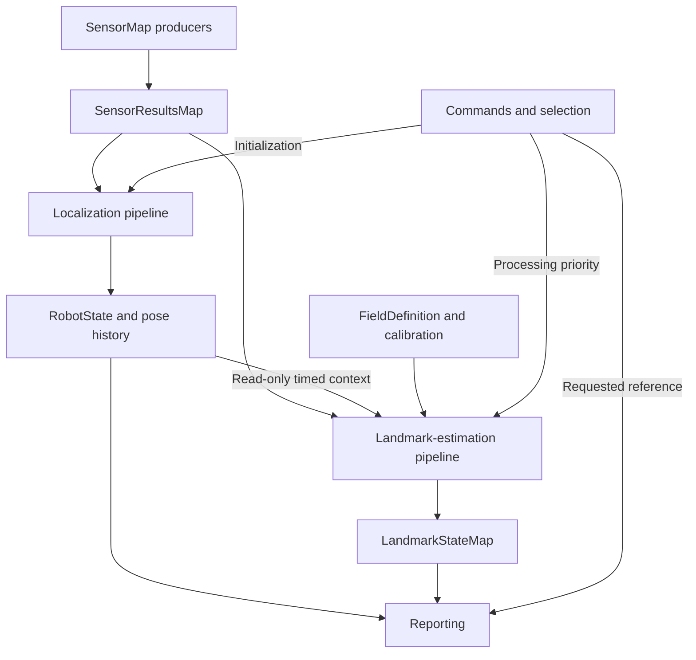

# Runtime architecture

Navigatr provides robot localization and information about a requested physical
reference through one Brain connection. The framework defines data boundaries,
ownership, and scheduling. Configured implementations define the sensors and
estimation algorithms behind those boundaries. These are design requirements;
see [implementation coverage](../README.md#implementation-coverage) for executable
support.

## Components and ownership

| Component | Owns | Publishes or provides |
|---|---|---|
| Resources | Shared devices, decoders, immutable geometry and calibration. | Explicitly bound device and configuration interfaces. |
| SensorMap | Configured measurement producers indexed by opaque sensor ID. | Publications with declared payload types. |
| SensorResultsMap | The standardized read view of sensor records. | Health, latest sample, measurement and receipt times, source sequence. |
| Localization pipeline | Robot estimation state and recent motion history. | Complete state snapshots and timestamped pose lookup. |
| Landmark-estimation pipeline | Accepted evidence and a cache of measured object estimates. | An immutable LandmarkStateMap snapshot with geometry and observation provenance. |
| Command handling | Initial pose, selection, request generation, stream controls. | Consistent command snapshots. |
| Reporting | Consumer representation and transport. | Robot state, at most one requested landmark, timing, and availability. |

The Brain owns desired robot poses, standoff, mechanism offsets, front/rear
approach, control, and completion. The landmark estimate describes physical
geometry; it does not embed those behavior decisions.

## Pipelines and standard I/O



Arrows represent data dependencies. There is no global requirement to complete
every box once before another pipeline can advance. Both estimation pipelines
run independently; their internal steps run in series. Reporting selects a
reference from the published cache and derives its output representation.

| Pipeline | Standard input | Standard output |
|---|---|---|
| Localization | Declared measurement view, initialization/reset commands, prior estimator state. | RobotState snapshot and associated pose history. |
| Landmark estimation | Declared measurement view, selection priority, available robot history, prior LandmarkStateMap; configured field and calibration resources. | LandmarkStateMap snapshot containing accepted measured estimates and provenance. |
| Reporting | Published RobotState and LandmarkStateMap snapshots, current selection and health; configured reference definitions. | Robot report plus at most one requested landmark report; no estimator mutation. |

The names below describe proposed contracts, not declarations already available
in the C++ implementation. Resources such as calibration and FieldDefinition
are bound during construction. Each invocation receives only the measurement,
command, prior-state, and read-only timing context needed by that implementation.

## Field definition and initial placement

FieldDefinition is immutable configuration: field frame and units, dimensions or
boundary geometry, nominal landmark poses, identities, reference frames, sensing
features, and declared symmetries. Measured object state lives in LandmarkStateMap;
observations do not overwrite the nominal definition.

An approximate initial robot pose anchors local odometry in that field frame.
The anchor is a rigid transform, including rotation as well as translation.
Its error is inherited by robot pose and by landmarks transformed through robot
pose. That common error can cancel when deriving their relative geometry, while
association against the independent nominal map must tolerate the initial
placement error, accumulated motion error, and actual landmark displacement.
The allowed range depends on the association alternatives and measurement quality;
it is not an arbitrary guarantee that the nearest nominal object is correct.

See [initial pose and coordinate continuity](coordinates.md#initial-pose-and-coordinate-continuity)
for the transforms and examples. Nominal bounds describe the configured field;
do not clamp estimates to the field edge to conceal localization error.

## Localization pipeline

```text
Measurement preparation -> Motion/pose observation extraction
  -> Robot state estimation -> Publish RobotState and pose history
```

Preparation handles the selected measurement formats and calibration. Extraction
produces explicitly typed motion or pose evidence. State estimation combines
appropriate evidence with its previous state. Publication exposes a complete
estimate and coherent history. These are standard boundaries; the framework does
not prescribe a tracking-wheel model, IMU, camera, or fusion algorithm.

For example, a wheel implementation can calibrate counts and apply wheel geometry
before exposing a body-motion increment. A different implementation can supply
pose observations. A composite can contain several contributors and fusion steps,
but it must track evidence provenance so several products derived from one source
are not silently counted as independent measurements.

## Landmark-estimation pipeline

```text
Measurement preparation -> Observation extraction -> Candidate generation
  -> Geometry estimation -> Association resolution -> Landmark state estimation
  -> Publish LandmarkStateMap
```

| Stage | Input | Output | Responsibility |
|---|---|---|---|
| Measurement preparation | Relevant SensorResultsMap records and any required new-sample batches. | PreparedMeasurementMap. | Select new work, normalize/calibrate data, preserve measurement time and source coordinates. A camera implementation can crop or rectify while retaining the pixel-coordinate mapping. |
| Observation extraction | PreparedMeasurementMap. | ObservationMap. | Extract evidence: for example IDs and corners, measured ranges, or already available relative poses. Include quality and source provenance. |
| Candidate generation | ObservationMap, static definitions, available motion/cache priors, selection priority. | CandidateSet. | Enumerate plausible object and feature/mount assignments, including joint assignments for several observations. Prune only where the evidence supports it. An assignment here is a hypothesis. |
| Geometry estimation | CandidateSet with its source observations, calibration, mount geometry, and measurement-time robot poses. | LandmarkHypothesisSet. | Solve or transform candidate geometry into the declared common estimation frame, with residuals, support, and pose alternatives. Several observations may constrain one hypothesis. |
| Association resolution | LandmarkHypothesisSet and applicable nominal/cache priors. | LandmarkEvidenceMap. | Group symmetry-equivalent hypotheses, evaluate quality/consistency and competing identities, and accept supported object evidence or retain ambiguity. |
| Landmark state estimation | LandmarkEvidenceMap and previous LandmarkStateMap. | Next LandmarkStateMap. | Initialize/update the measured cache, handle duplicate or delayed evidence, maintain observation age and validity, and preserve consistent orientation representatives. |

Publication commits the completed cache snapshot after the state-estimation
stage succeeds. Reporting is a separate consumer; it does not require another
observation to select an existing usable entry. Deriving a named face and its
heading-error representation belongs at that reporting boundary, using the
configured reference/side-selection meaning.

The geometry stage produces hypotheses because repeated IDs can require metric
geometry to decide association. It must not assert identity merely to obtain a
pose. Where a producer already supplies a pose, geometry estimation can transform
that pose rather than solve it again. Where partial evidence is all that a sensor
provides, the typed contract must preserve that limitation; an estimator that
supports such evidence may accumulate it, while an incompatible implementation
must be rejected at configuration time. No stage invents unmeasured coordinates.

For an AprilTag example: preparation provides a calibrated image view; extraction
produces tag IDs/corners; candidate generation finds compatible physical mounts;
geometry estimation fits each supported assignment and applies camera mounting
plus capture-time robot pose; association resolution decides which object
hypotheses the evidence supports; state estimation updates those cache entries.
Candidate assignments can share a per-tag pose solve when their tag size and
camera calibration agree; applying a different mount transform does not require
rerunning detection or that same pose solve.

## Composing and exchanging implementations

Each semantic stage has a declared input/output contract. Its implementation can
be a leaf algorithm or a composite containing a private sequence of child stages.
The same rule applies recursively. A composite presents its parent's contract
to its caller and publishes only the outputs declared at that boundary.

For example, an observation-extraction composite can run detection, decode-quality
filtering, then corner-quality annotation on an ObservationMap. A geometry
composite can normalize poses, fit several compatible observations jointly, then
attach fit diagnostics. An association composite can apply range, visibility,
and consistency filters before resolving competing hypotheses. A typed batch
passes down the chain with each boundary defining the information now available.

Implementations are interchangeable when their declared contracts are compatible.
Examples include different detectors behind extraction, lookup or geometric
candidate generation, single-observation or joint-fit geometry, and different
state estimators behind cache update. Startup must verify referenced producers,
payload types, coordinate/unit expectations, and required metadata. A matching
function signature alone does not establish compatibility.

Children execute in configured order within the composite. Several children can
contribute records to a declared aggregate, or successively filter/annotate an
existing typed collection. Output ownership and merge behavior must be explicit;
one child cannot silently overwrite another's named product. All contributors
retain source identity so the final estimator can recognize shared evidence.

Persistent estimator state has one owner. Intermediates remain private until a
successful publication; a child fault cannot partially commit the outer state.
The selected composite may explicitly reject individual bad observations while
continuing with valid ones. Adding children does not create threads automatically
or let the outer coordinator invoke their private stages independently.

Consumers bind to source IDs and payload contracts during startup. For example,
a localization implementation can consume body-motion increments without knowing
which encoders produced them. Another may consume pose observations. Landmark
observations may originate from cameras, range sensors, or other suitable
measurements. Neither outer interface requires AprilTags, wheels, or a particular
number of sensors. A payload must express what was measured: an image region
alone cannot promise a full metric pose.

## Scheduling and handoff

Use one executable with independently scheduled localization and landmark workers.
Stages inside a worker run in their declared order. Resource acquisition and
transport may have their own workers or asynchronous callbacks as needed.
Execution frequency and resource budgets belong to configured implementations;
the framework does not assume localization is faster than landmark estimation.

Localization computes its next state privately and publishes a complete snapshot.
A landmark operation reads a consistent published state or history snapshot when
needed. A short mutex-protected handoff or an appropriate atomic snapshot
publication can implement this. Do not hold shared locks during detection,
estimation, blocking device reads, or output writes.

Sensor collection obtains available publications. Waiting for one physical sensor
must not block unrelated producers. Shared links have one acquisition/decoder
owner that distributes their channels. Consumers must not independently drain
the same device. Expensive preparation belongs to its consuming pipeline, or to
an independently scheduled shared producer if several consumers need its output.

The result map is a read interface, not sufficient storage for every possible
measurement stream. Queue or accumulate measurements according to their meaning.
Replacing pending camera frames with newer ones can bound latency; dropping
intervening motion increments or angular-rate samples can lose motion. Each
consumer tracks consumed source sequences. Reading a retained sample again does
not produce another measurement.

Sensor health, new publication, and measurement freshness are separate. A healthy
sensor between samples retains its latest record. A fault does not rewrite its
measurement timestamp. Reporting and transport must also have bounded work so
their backpressure cannot stop estimation.

## Pose history

Keep the latest robot state and a time-ordered ring buffer of recent poses. Five
seconds is the initial retention target; configure the window and maximum lookup
gap from measured sensor latency and acceptable error. At 50 pose publications
per second, five seconds contains about 250 samples. A faster producer needs
more capacity to retain the same duration.

Each entry identifies the host-clock effective time, odometry epoch, and pose of
the fixed robot origin in smooth odometry coordinates. Entries are logically
sorted by time even when the ring wraps physically. Binary-search that logical
order for bracketing samples. Search is O(log N); no benchmark is implied.

For measurement time `t` between samples `t0` and `t1`, use:

```text
f = (t - t0) / (t1 - t0)
x(t) = x0 + f * (x1 - x0)
y(t) = y0 + f * (y1 - y0)
yaw(t) = wrap(yaw0 + f * wrap(yaw1 - yaw0))
```

This is a short-interval interpolation model. Gate the bracketing interval and
motion conditions so unresolved motion between samples does not become a claim
of precision. Exact timestamp matches use the recorded pose. Reject measurements
older than retained history or across invalid gaps/epochs. A measurement newer
than available history can wait in a bounded pending queue for a bracket; expiry
is explicit. Do not silently clamp unsupported times to the nearest pose.

Append later timestamps and define replacement for a revised estimate at the same
timestamp. Do not append out-of-order entries. A discontinuous odometry reset
starts a new epoch. Lookups must see a consistent ring layout and anchor revision
while the writer appends or retires entries. A reader copies the required samples
or retains an immutable history snapshot before releasing the handoff lock.

## Time, identity, and lifecycle

A measurement timestamp describes when sensing happened. Receipt, processing
completion, and report transmission are separate times. Camera metadata must
define the exposure-time convention; timebase conversion must place camera and
motion samples on a common monotonic clock. Source restarts cannot silently reuse
an earlier sequence/time identity.

Late observations use the robot pose at measurement time, then the transforms in
[Coordinates](coordinates.md#measurement-time-transforms). Processing delay does
not change the observation time. Pose history corrects temporal registration;
it does not remove measurement error, subsequent odometry drift, or unseen
landmark motion.

Selection has an identity and a generation. Reporting reads the current request
and the matching cache entry; clearing or changing that request immediately changes
what may be reported. Independently validated late evidence can update the cache
under its object identity and ordering policy, but cannot reactivate an old request
or overwrite the selected result with another object's data. Selection-specific
work must also validate its generation before committing selection-specific state.
Field-definition identity, field-anchor revision, and odometry epoch accompany
state so incompatible coordinates cannot be combined.

Reporting reads consistent snapshots. If robot and landmark estimates have
different effective times, preserve that timing or reconcile them at a supported
time. A common packet timestamp cannot conceal the difference. A stationary
landmark may be carried to report time under an explicit stationarity assumption;
its last accepted observation time still remains unchanged.

## Behavioral verification

Verify that delaying either estimator does not stall the other's publications;
that motion contributions survive batching; and that a sensor stall does not
block unrelated acquisition. Exercise ring wrap, angular wrap, history expiry,
unsupported gaps, source restarts, selection changes during processing, and
coordinate resets. Verify handoffs never expose mixed state and that an
observation is consumed at most once by a given estimator.

Measure capture-to-result age, estimator publication intervals, dropped work,
and physical alignment error independently. Processing rate and successful host
tests do not establish measurement accuracy.
